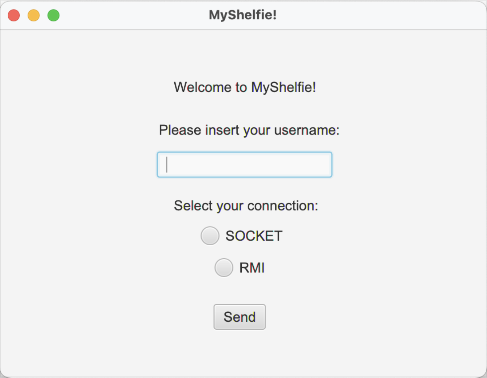
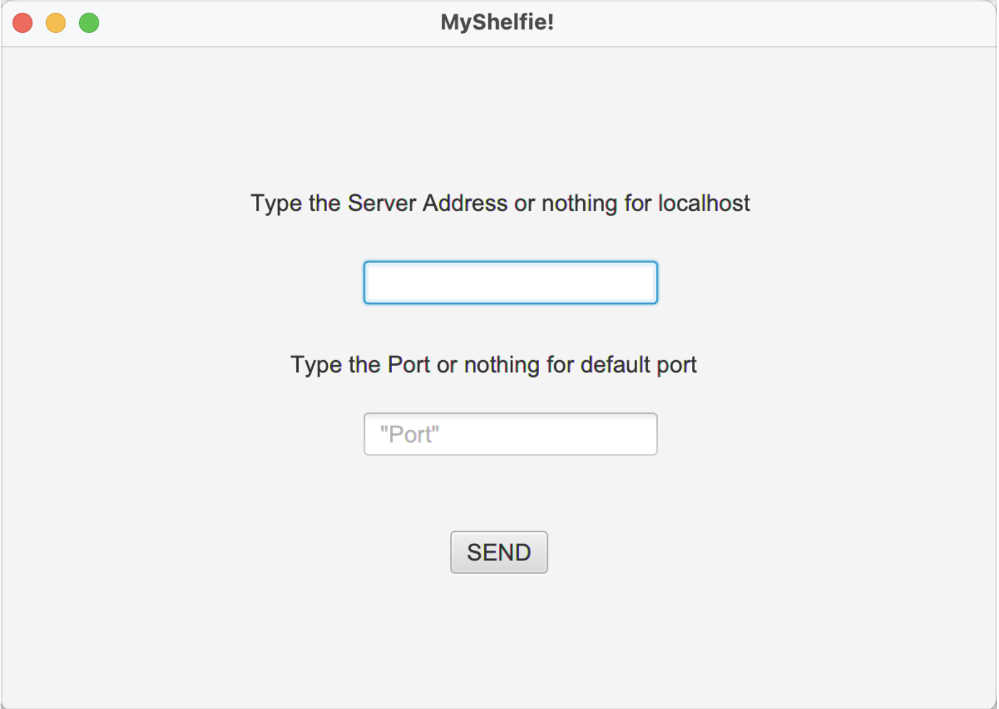
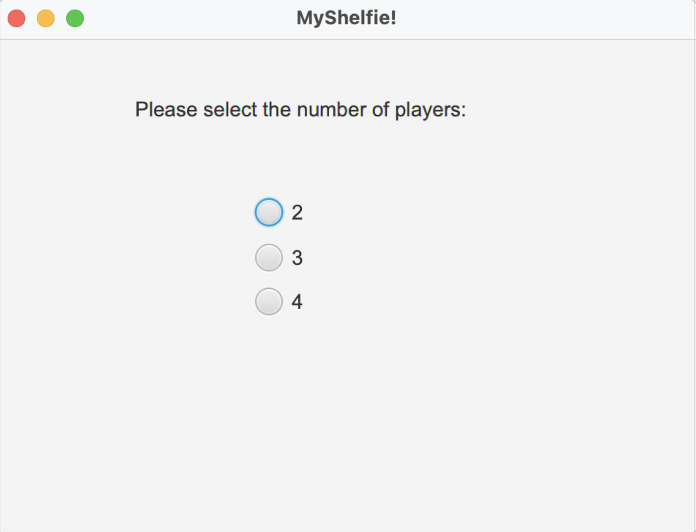
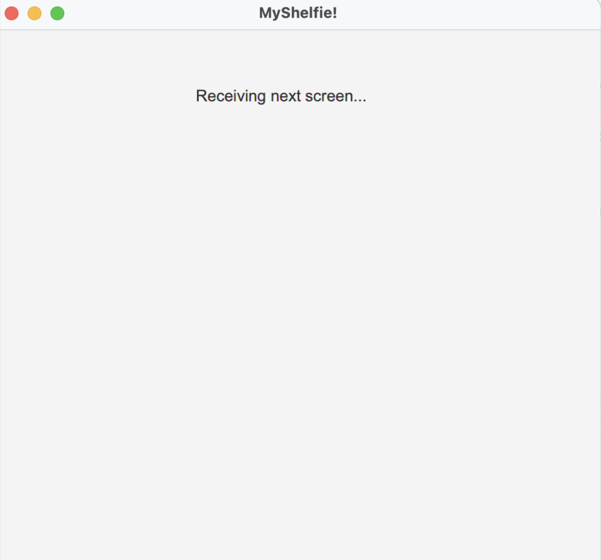
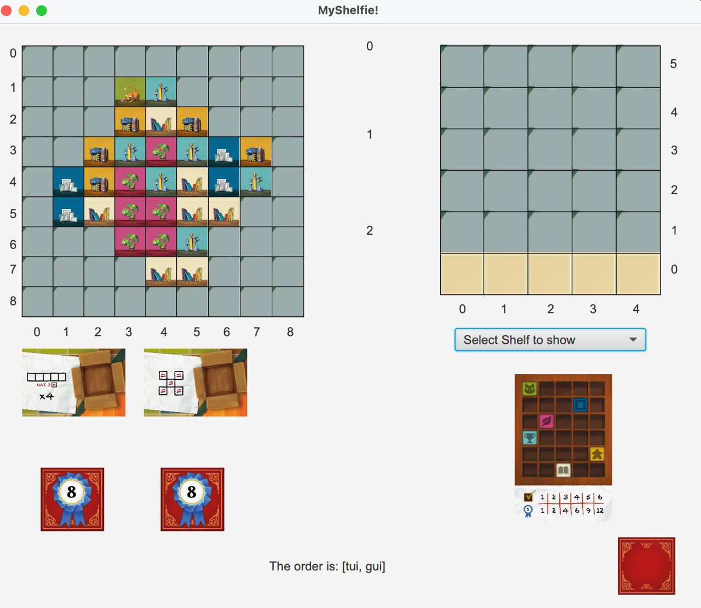
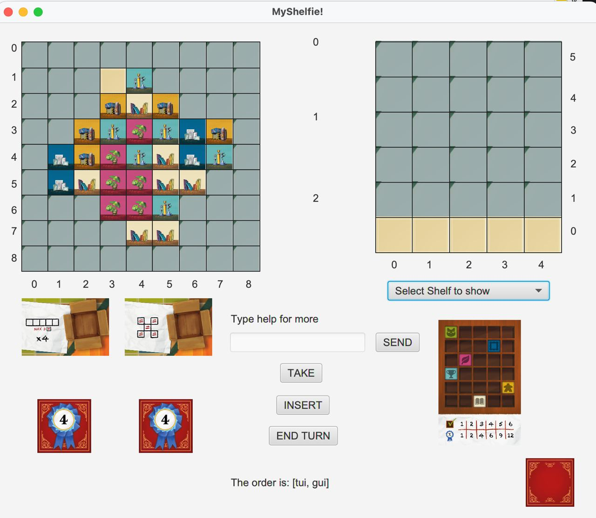

# Prova Finale di Ingegneria del Software - AA 2022-2023
### Team: 
- [**Mattia Lucamarini**](https://github.com/mattia-lucamarini)
- [**Angelo Di Rosa**](https://github.com/Angelodirosa)
- [**Paolo Ceffa**](https://github.com/poolll98)
- [**Mohammad Shaffaeet**]()
# My Shelfie


Implementazione in Java del gioco da tavolo [My Shelfie](https://www.craniocreations.it/prodotto/my-shelfie).

Il progetto è realizzato tramite un sistema distribuito composto da un singolo server, capace di gestire partite multiple
in contemporanea, e multipli client che possono partecipare ad una partita alla volta utilizzando una tecnologia di rete
a scelta tra RMI e Socket, entrambe supportate in contemporanea dal server.
Il giocatore può decidere di giocare una partita utilizzando a suo piacimento un'interfaccia testuale (TUI) oppure un'
interfaccia grafica (GUI).
L'implementazione segue il pattern MVC (Model-View-Controller).

## Funzionalità
- __Regole Complete__: Si considerino tutte le regole per lo svolgimento di normali partite, come indicato nel manuale del gioco.
- __Interfaccia utente__: CLI & GUI
- __Rete__: Socket & RMI
- __2 FA__ (Funzionalità Avanzate):
  - __Partite multiple__: il server può gestire più partite contemporaneamente, ognuna delle quali viene gestita in maniera 
  indipendente dalla altre.
  - __Resilienza alle disconnessioni__: I giocatori disconnessi a seguito della caduta della rete o del crash del client, 
  possono ricollegarsi e continuare la partita. Mentre un giocatore non è collegato, il gioco continua saltando i turni di quel giocatore.

## Librerie e Plugins
| Libreria/Plugin | Descrizione                                    |
|-----------------|------------------------------------------------|
| __Maven__       | Software project management and comprehension tool|
| __JavaFx__      | GUI toolkit for Java                           |
| __JUnit__       | Unit testing framework for Java     |
| __Mockito__     | Mocking framework for testing purpose |

## Documentazione
### UML
Consultare la documentazione UML [qui](deliverables/uml).
### JavaDoc
Consultare la documentazione JavaDoc [qui](deliverables).

## Run the Application

**Warning**: Assicurati di avere i rispettivi jars nella cartella [jar](deliverables/jar). 
E' possibile produrre i jars dell'applicazione seguendo i seguenti steps:
1. Apri il progetto utilizzando IntelliJ.
2. Click sulla Maven Projects sidebar nella parte destra della finestra, espandi il progetto e identifica la voce ```Lifecycle section```. 
3. Double-click su ```package``` goal.
4. Una volta completata la fase di build, Maven creerà i JAR files nella cartella target del tuo progetto. Spostali nella directory: ```deliverables/jar```.

### Run the Server
Il Server può essere lanciato seguendo due procedimenti:
1. Eseguendo direttamente il jar file [server.jar](deliverables/jar/server.jar):

```
cd deliverables/jar 
java -jar server.jar [--ports <socket_port_number> <rmi_port_number>]
```

L'argomento ```--ports``` specifica le porte dove mettere in ascolto il Server per accettare connessioni dai client utilizzando
rispettivamente Socket ed RMI. Essendo opzionale, se omesso, i valori di default sono i seguenti:
  - <socket_port_number> = 59090
  - <rmi_port_number> = 1099
2. Utilizzando Docker: seguire l'apposita guida [qui](deliverables/jar/README.md).

### Run the Client
E' possibile eseguire il client tramite interfaccia grafica (GUI), oppure tramite interfaccia testuale (TUI),
la scelta avviene appena lanciato il seguente jar file [client.jar](deliverables/jar/client.jar), così come 
l'inserimento dell'indirizzo IP del server a cui collegarsi:

``` 
cd deliverables/jar 
java -jar client.jar
```
## GUI Guide
In questa sezione viene presentata una panoramica della GUI offerta al giocatore.
Una volta selezionata l'opzione di giocare tramite interfaccia grafica, apparirà la segunte schermata di login:



Inserite il vostro username e selezionate il tipo di connessione desiderata. Dopodiché premere il tasto “Send”.

Verrete rimandati ad una scena di selezione sell'indirizzo IP e della porta del server a cui provare a collegarsi.
Potete inserirli a vostro piacimento o semplicemente premere il tasto “Send” e optare per quelli di default (vedere sezione 
precedente per i valori di default).



Premuto “Send” comparirà una label con scritto la porta e l’indirizzo IP selezionato.

A questo punot, se si è il primo giocatore a collegarsi a una nuova partita, verrà richiesto il numero di giocatori con cui
formare una nuova partita tramite la seguente schermata:



Selezionate il numero di giocatori voluto, dopodichè la scena cambierà nella seguente schermata di transizione:



Attendete che la game scene carichi e verrà mostrata la schermata di gioco non ancora inizializzata del tutto.
Quando tutti i players si saranno collegati, la schermata verraaggiornata a partire dai goals personal e common.
Mentre si attenda il collegamento degli altri giocatori si verrà notificati con il messaggio ”Waiting for other players”.
Una volta iniziata la partita verranno inizializzate anche la board e le shelfs (propria e degli altri giocatori).

La schermata di gioco, durante il turno degli altri gicoatori, apparirà come segue:



Non resta che attendere il proprio turno quando verrà sbloccato il box comandi per effettuare le proprie mosse.
Nel frattempo, durante il turno di qualsiasi altro giocatore, si possono visualizzare le shelfs degli altri giocatori
selezionando il rispettivo username all’interno della ComboBox dedicata. 
All'inizio del proprio turno, la board e tutte le shelfs verranno aggiornate mostrando gli aggiornamenti di gioco causati
dagli altri gicoatori.

La schermata di gioco durante il proprio turno appare come segue:



### Comandi di gioco
I comandi di gioco sono i seguenti:
- **Help**: Digitare "help" nella textbox e premere "Send" per ottenere una spiegazione dei comandi.
- **Take**: Seleziona le tiles dalla board che si vogliono prendere. Per selezionare una tile digitare nella textbox
i suoi indici secondo il seguente formato: ```<riga> blankspace <colonna>``` e premere "Send".
Di default ci si aspetta di di selezionare 3 tiles, per prendere solo 1 o 2 tiles digitare "done" nella textbox e premere
"Send". 
Altrimenti, automaticamente verranno inviate le scelte al server per essere validate. Dopo aver ricevuto la conferma
dal server si può procedere ad inserire le tiles nella propria shelf.
- **Insert**: Permette di inserire le tiles precedentemente selezionate nella propria shelf. Digitare nella textbox le 
coordinate di dove si vuole inserire la tile corrente secondo il formato: ```<riga> blankspace <colonna>``` e premere "Send".
Una volta inserita l'ultima tile nella shelf aspettare il messaggio di verifica da parte del server. 
Dopodichè è possibile concludere il turno.
- **End Turn**: Permette di concludere  il proprio turno. Una volta premuto il pannello comandi scomparirà e verrà passato
il turno al giocatore successivo.


